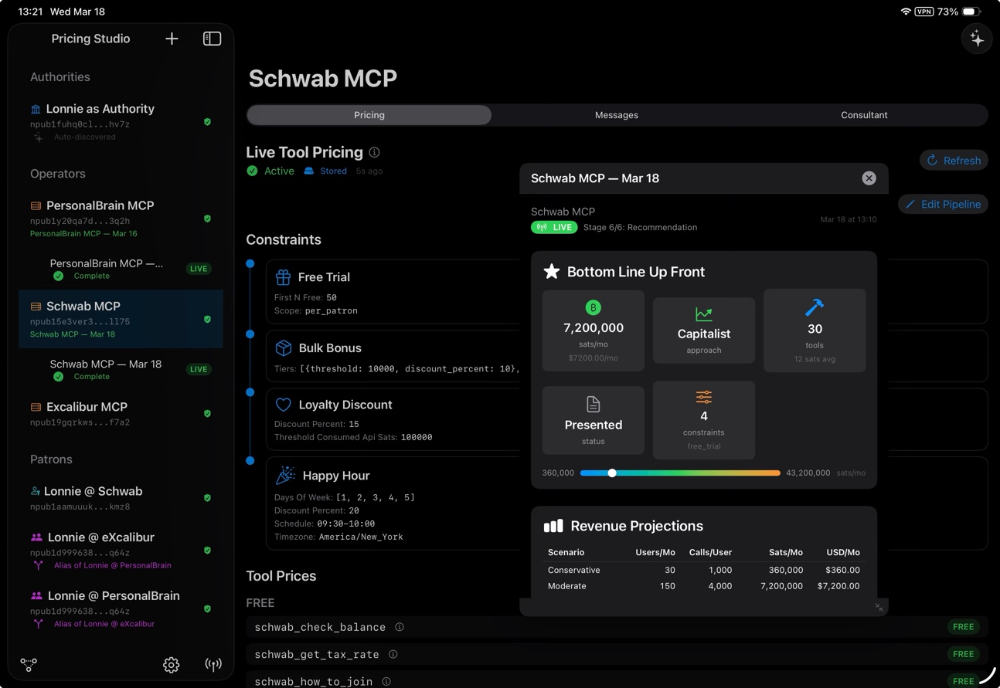
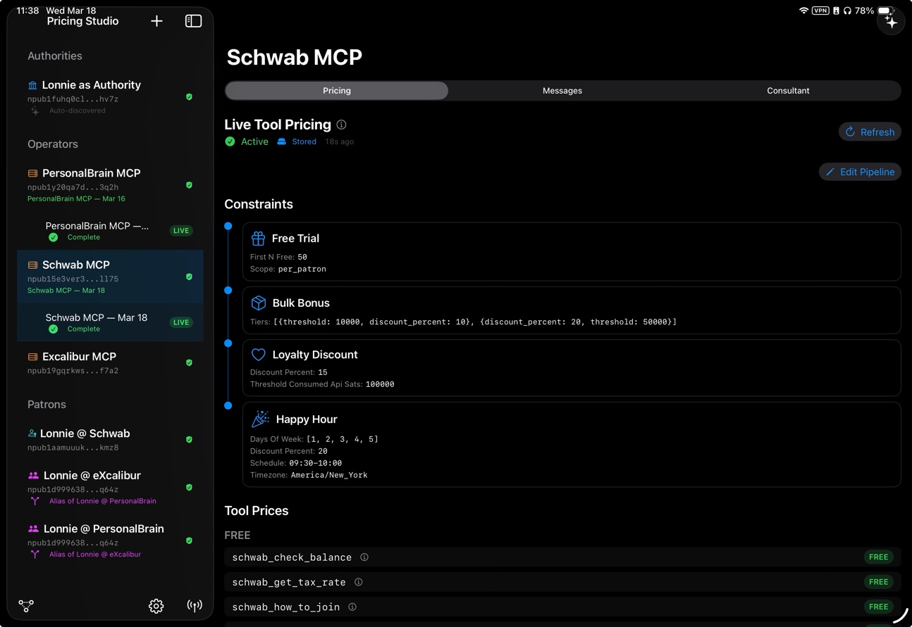
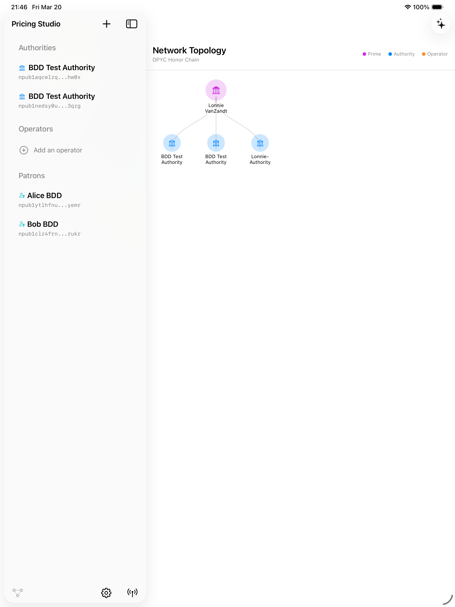

# Pricing Studio

[](https://developer.apple.com/ipados/)
[](https://www.swift.org)
[](LICENSE)

Native iPadOS workbench for [DPYC](https://github.com/lonniev/dpyc-community) Operators to inspect, design, simulate, and deploy Tollbooth pricing models. Connects to any Tollbooth MCP endpoint over SSE with automatic OAuth2 Bearer auth. Includes a built-in Nostr DM client for multi-identity encrypted messaging, a 6-phase AI pricing consultant powered by Claude, and an independent pricing review from xAI Grok.

<p align="center">
  
</p>

## Features

### Live Pricing Editor

Load any Operator's pricing model from its MCP endpoint. Edit per-tool prices inline, add or remove constraint pipeline steps, and diff your changes against the live server state before pushing. Push changes directly to the Operator's MCP endpoint or keep them as local edits.

<p align="center">
  
</p>

#### Constraint Pipeline

11 constraint types across four categories:

| Category | Constraints |
|----------|------------|
| **Pricing** | `free_trial` (first N free), `coupon` (code-gated discounts with global/per-patron caps and expiry), `loyalty_discount` (threshold-based), `bulk_bonus` (tiered multipliers), `happy_hour` (temporal window with timezone, day-of-week recurrence), `surge_pricing` (demand-elastic from global counters) |
| **Access** | `temporal_window` (time-of-day restriction), `finite_supply` (global or per-patron invocation cap), `periodic_refresh` (rate-limit per rolling ISO-8601 window) |
| **Dynamic** | `json_expression` (safe expression tree with and/or/not combinators) |
| **Identity** | `patron_proof` (require Schnorr signature proof of npub ownership) |

### 6-Phase Pricing Campaign Interview

An AI pricing consultant (Claude) walks Operators through a structured interview to design a complete pricing model:

1. **Inventory** — discover the Operator's tool catalog and service context
2. **Demand** — probe usage patterns and price sensitivity
3. **Value** — map tool value to willingness-to-pay
4. **Cost** — establish floor costs and margin requirements
5. **Constraints & Demurrage** — design the constraint pipeline and decay policies
6. **Recommendation** — Bottom Line Up Front with 3 revenue scenarios (conservative, moderate, aggressive), A/B/C variant proposals, and a deployable pricing model

Each phase runs as an isolated conversation with synthesized context from prior stages. Revisit any stage to refine without losing progress. Fork campaigns for what-if exploration.

### Second Opinion from Grok

Before deploying, get an independent pricing review from xAI Grok. The review is structured into section cards (Strengths, Risks, Alternatives, Revenue Impact, Verdict). Dismissing the review automatically feeds Grok's suggestions back to Claude for revision.

### Multi-Identity Nostr Chat

A full encrypted DM client built on NIP-04, NIP-44v2, and NIP-17 gift wrap. Switch between Operator, Authority, and Patron identities for independent conversation threads. Features include:

- **Identity switching** — each sidebar entity has its own Nostr keypair and conversation history
- **Background DM polling** — parallel relay fetching across all identities with unread indicators
- **Secure Courier** — interactive credential forms rendered inline from `@@@field@@@` payloads with anti-replay poison and provenance metadata
- **Authority claim protocol** — 4-phase guided flow (Form, Challenge, Verifying, Result) for claiming Authority control via Nostr DM challenge-response
- **NIP-09 deletion** — delete messages from relays after receipt
- **Duplicate deduplication** — prefers NIP-44 over NIP-04 when both versions exist

### Network Topology

Visual graph of the DPYC Certification Chain hierarchy: Prime Authority &rarr; Authorities &rarr; Operators. Auto-discovers upstream Authorities when loading Operator pricing models.

<p align="center">
  
</p>

### Operator Management

- **Adopt Operator** — register unclaimed operators via an Authority's MCP endpoint
- **Pending Adoptions** — Authority owner queue of operator-initiated adoption requests (deferred-courtship flow), reviewed and approved from the Authority view
- **Onboarding status** — credential readiness dashboard for operators and patrons
- **Account statements** — SVG/PNG infographic rendering of patron balances
- **Bitcoin notarization** — Merkle tree construction + OpenTimestamps submission with per-patron inclusion proofs
- **Operator proof (NIP-98)** — kind-27235 Schnorr-signed events for high-value MCP tool authorization

### Traffic Log

Real-time inspector for all MCP, HTTP, and Nostr relay traffic. Nostr events hidden by default (toggle on to see DM poll/fetch/send/decrypt). Regex search across labels, URLs, and request/response bodies. Rolling buffer capped at 2,000 entries.

### Wrist Approval wake path (design)

Foreground relay subscriptions and the CloudKit `InboxSignal` peer-wake are
not always-on. Sleeping devices need APNs. The corrected architecture is a
**patron-operated Courier Bridge** plus an independent watchOS app — see
[`design/courier-bridge.md`](design/courier-bridge.md). Operators never hold
device tokens; wake pushes are content-free.

## Architecture

| Layer | Technology |
|---|---|
| UI | SwiftUI `NavigationSplitView` — three-pane iPad layout |
| Persistence | SwiftData with CloudKit sync (fallback to local-only) |
| MCP Transport | SSE (Server-Sent Events) with automatic OAuth2 Bearer auth (401 challenge handling) |
| Nostr | NIP-04 + NIP-44v2 encryption, NIP-17 gift wrap, NIP-59 seal, NIP-09 deletion, NIP-98 HTTP auth |
| AI Consultant | Claude (Anthropic API) — streaming, per-stage isolated conversations |
| Second Opinion | xAI Grok (OpenAI-compatible API) |
| Identity | Nostr keypairs (nsec/npub) stored in iOS Keychain |
| Local MCP SDK | [swift-sdk](LocalPackages/swift-sdk/) — SSE transport, swift-nio, swift-log |

### Entity Model

- **Authority** — certification body in the DPYC Certification Chain with MCP endpoint
- **Operator** — MCP service provider with pricing model, tool catalog, and constraint pipeline
- **Patron** — end user with Nostr identity for multi-identity DM support (alias detection for shared npubs)
- **Campaign** — persisted pricing interview with per-stage messages, revenue projections, A/B/C variants, and deployment state

## Build & Deploy

Requires Xcode 16+ and an Apple Developer account for device deployment.

```bash
# Fast incremental debug build (device)
make dev

# Build + deploy to iPad over WiFi
make dev-wifi

# Full release archive + signed IPA
make export

# Run BDD feature tests (simulator)
make test-bdd-sim
```

| Target | Description |
|---|---|
| `make dev` | Debug build for device (~30s incremental) |
| `make dev-wifi` | Debug build + WiFi install |
| `make dev-install` | Debug build + USB install |
| `make archive` | Release .xcarchive |
| `make export` | Archive + signed IPA |
| `make install` | Full release + USB install |
| `make wifi-install` | Full release + WiFi install |
| `make test-ui-sim` | XCUITests on simulator |
| `make test-bdd-sim` | BDD feature tests on simulator |
| `make stamp` | Auto-increment build number + write timestamp |

## Testing

| Target | Framework | Coverage |
|---|---|---|
| `PricingStudioTests` | XCTest | Model/service unit tests (CourierPayload, constraint catalog, etc.) |
| `PricingStudioUITests` | XCUITest | 7 UI automation test classes (launch, apply, pipeline, constraint param editor, diff, traffic log, relays) |
| `PricingStudioBDDTests` | Gherkin/Cucumberish | 7 step definition files covering entity CRUD, Nostr messaging, operator registration, pipeline editing, traffic log |

## DPYC Ecosystem

| Repo | Role |
|------|------|
| [tollbooth-dpyc](https://github.com/lonniev/tollbooth-dpyc) | Python SDK — vault, auth, pricing, payments, Nostr identity |
| [dpyc-community](https://github.com/lonniev/dpyc-community) | Governance registry, membership, advisories, threat model |
| [dpyc-oracle](https://github.com/lonniev/dpyc-oracle) | Community concierge — free onboarding help and membership lookup |
| [tollbooth-authority](https://github.com/lonniev/tollbooth-authority) | Certification backbone — Schnorr-signed purchase order certificates |
| [tollbooth-sample](https://github.com/lonniev/tollbooth-sample) | Sample Operator — canonical template for new MCP services |
| [schwab-mcp](https://github.com/lonniev/schwab-mcp) | Charles Schwab brokerage data (operational example) |
| [thebrain-mcp](https://github.com/lonniev/thebrain-mcp) | TheBrain personal knowledge graph (operational example) |
| [excalibur-mcp](https://github.com/lonniev/excalibur-mcp) | X/Twitter posting (operational example) |
| [cypher-mcp](https://github.com/lonniev/cypher-mcp) | Monetized graph answers — named Cypher query templates over Neo4j/AuraDB (operational example) |
| [taxsort-mcp](https://github.com/lonniev/taxsort-mcp) | Tax classification + Cloudflare Pages UI (operational example) |
| [optionality-mcp](https://github.com/lonniev/optionality-mcp) | Options analytics (operational example) |
| [tollbooth-oauth2-collector](https://github.com/lonniev/tollbooth-oauth2-collector) | OAuth2 callback handler — shared advocate service |
| [tollbooth-shortlinks](https://github.com/lonniev/tollbooth-shortlinks) | URL shortener — lightweight utility service |
| [stablecoin.myshopify.com](https://stablecoin.myshopify.com) | DPYC merch and Austrian economics |

## Prior Art & Attribution

The methods, algorithms, and implementations contained in this repository may represent original work by Lonnie VanZandt, first published on March 12, 2026. This public disclosure establishes prior art under U.S. patent law (35 U.S.C. 102).

All use, reproduction, or derivative work must comply with the Apache License 2.0 included in this repository and must provide proper attribution to the original author per the [NOTICE](NOTICE) file.

### How to Attribute

If you use or build upon this work, please include the following in your documentation or source:

    Based on original work by Lonnie VanZandt and Claude.ai
    Originally published: March 12, 2026
    Source: https://github.com/lonniev/tollbooth-pricing-studio
    Licensed under Apache License 2.0

Visit the technologist's virtual cafe for Bitcoin advocates and coffee aficionados at [stablecoin.myshopify.com](https://stablecoin.myshopify.com).

### Patent Notice

The author reserves all rights to seek patent protection for the novel methods and systems described herein. Public disclosure of this work establishes a priority date of March 12, 2026. Under the America Invents Act, the author retains a one-year grace period from the date of first public disclosure to file patent applications.

**Note to potential filers:** This public repository and its full Git history serve as evidence of prior art. Any patent application covering substantially similar methods filed after the publication date of this repository may be subject to invalidation under 35 U.S.C. 102(a).

## Further Reading

[The Phantom Tollbooth on the Lightning Turnpike](https://stablecoin.myshopify.com/blogs/our-value/the-phantom-tollbooth-on-the-lightning-turnpike) — the full story of how we're monetizing the monetization of AI APIs, and then fading to the background.

## Trademarks

DPYC&trade;, Tollbooth DPYC&trade;, and Don't Pester Your Customer&trade; are trademarks of Lonnie VanZandt. See [TRADEMARKS.md](https://github.com/lonniev/dpyc-community/blob/main/TRADEMARKS.md) in the dpyc-community repository for usage guidelines.

## License

Apache License 2.0 — see [LICENSE](LICENSE) and [NOTICE](NOTICE) for details.

---

*Because in the end, the tollbooth was never the destination. It was always just the beginning of the journey.*
